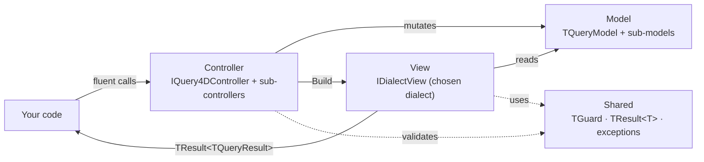

# Query4D

> A Delphi library for building SQL queries the **fluent, parameterized, and safe** way —
> no string concatenation, no SQL injection.

[](LICENSE)
[](https://www.embarcadero.com)
[](docs/DIALECTS.md)
[](docs/ARCHITECTURE.md)

[English](README.md) · [Português (BR)](README.pt-BR.md)

---

## Table of Contents

- [What it is](#what-it-is)
- [Why use it](#why-use-it)
- [Installation](#installation)
- [Quick start](#quick-start)
- [Features](#features)
- [Usage guide](#usage-guide)
  - [SELECT / FROM](#select--from)
  - [WHERE and operators](#where-and-operators)
  - [Logical grouping (AND/OR)](#logical-grouping-andor)
  - [JOINs](#joins)
  - [ORDER BY / GROUP BY / HAVING](#order-by--group-by--having)
  - [Pagination](#pagination)
  - [CTE (WITH) — simple and recursive](#cte-with--simple-and-recursive)
  - [INSERT](#insert)
  - [UPDATE](#update)
  - [DELETE](#delete)
  - [RETURNING](#returning)
  - [Build and result handling](#build-and-result-handling)
- [Supported dialects](#supported-dialects)
- [Safety](#safety)
- [Architecture](#architecture)
- [Repository layout](#repository-layout)
- [Examples and demo](#examples-and-demo)
- [Documentation](#documentation)
- [Roadmap](#roadmap)
- [Contributing](#contributing)
- [License](#license)

---

## What it is

Query4D is a **query builder** — a fluent API that assembles SQL dynamically through
method chaining. Inspired by [Knex.js](https://knexjs.org/), it brings the same ergonomics
to the Delphi ecosystem.

**It is not an ORM:** it does not map objects to tables, does not manage connections, and
does not execute queries. It hands you the finished `SQL` and `Params`, ready to feed to your
data-access layer of choice (FireDAC, UniDAC, dbExpress, etc. — or paired with
[Conn4D](https://github.com/gabrielcb08/conn4d) for pooled connections).

Use it whenever you need to assemble SQL **conditionally**, in a readable and safe way,
without falling into the string-concatenation trap.

---

## Why use it

| Problem with string SQL | Query4D's answer |
| ----------------------- | ---------------- |
| SQL injection through concatenation | Every value becomes a **bind param** (`?` / `$N`) |
| `UPDATE`/`DELETE` without WHERE wiping a table | `EUnsafeOperation` raised before rendering |
| Per-database SQL scattered across the code | One query → 4 dialects, switch in a single line |
| Conditional queries with unreadable `if`/concat | Chainable, self-documenting fluent API |
| No precondition checks | `TGuard` validates every public entry point |

- **Zero external dependencies** — no VCL/FMX/FireDAC in the library core.
- **Non-visual `TQuery4D` component** to drop on the Form Designer.
- **Functional error handling** with `TResult<T>` — no exceptions during rendering.

---

## Installation

### Via Boss (recommended)

```bash
boss install github.com/gabrielcb08/query4d@v1.0.0
```

### Manual (IDE)

1. Download or clone this repository.
2. Open `packages/Delphi12/Query4D.dpk` in the Delphi IDE.
3. Click **Compile**, then **Install**.
4. The `TQuery4D` component appears on the **ORData** palette.

### Adding to your project

In **Project → Options → Delphi Compiler → Search Path**, add the `src\` folders:

```
..\Query4D\src
..\Query4D\src\Shared
..\Query4D\src\Model
..\Query4D\src\View
..\Query4D\src\Controller
```

Then declare in your units:

```delphi
uses
  Query4D.Controller,   // TQuery4DController
  Query4D.View.MySQL;   // TMySQL8View (or PostgreSQL, Firebird, SQLite)
```

---

## Quick start

```delphi
uses
  Query4D.Controller,
  Query4D.View.MySQL;

var
  R := TQuery4DController.New(TMySQL8View.New)
    .From('orders', 'o')
    .Select(['o.id', 'o.number', 'o.total'])
    .BeginWhere
      .Equal('o.status', 'approved')
      .GreaterThan('o.total', '100')
    .EndWhere
    .OrderBy('o.created_at', odDesc)
    .Limit(20)
    .Build;

if R.IsOk then
  MyConnection.Execute(R.Value.SQL, R.Value.Params);
```

Generated SQL (MySQL):

```sql
SELECT o.id, o.number, o.total
FROM orders AS `o`
WHERE o.status = ?
  AND o.total > ?
ORDER BY o.created_at DESC
LIMIT 20
```

### Via the Form Designer component

Drop a `TQuery4D` on the form, set the `Dialect` property in the Object Inspector, and call
`NewQuery` in code — no need to import dialect units:

```delphi
// QueryBuilder: TQuery4D (on the form, Dialect = dPostgreSQL)
var R := QueryBuilder.NewQuery
  .From('customers')
  .WhereEq('active', '1')
  .Limit(10)
  .Build;
```

---

## Features

- [x] **SELECT** with fields, inline alias, expressions, `DISTINCT` and `SelectAll`
- [x] **Typed field sub-builder** (`BeginFields` / `AddAs`)
- [x] **WHERE** with every operator: comparison, LIKE, nullability, range, list, boolean and raw expression
- [x] **Logical groups**: `OrBegin`/`OrEnd`, `AndBegin`/`AndEnd` (nestable)
- [x] **JOINs**: INNER, LEFT, RIGHT, FULL OUTER, CROSS — with alias
- [x] **ORDER BY** with `NULLS FIRST` / `NULLS LAST` (native or dialect-emulated)
- [x] **GROUP BY + HAVING**
- [x] **Pagination**: `Limit`, `Offset`, `First`
- [x] **CTE** (`WITH ... AS`) simple and **recursive**
- [x] **INSERT** single and **bulk** (multiple rows)
- [x] **UPDATE** and **DELETE** with a mandatory WHERE guard
- [x] **RETURNING** (PostgreSQL and SQLite 3.35+)
- [x] **Typed parameters** — never string interpolation
- [x] **Non-visual `TQuery4D` component** for the Form Designer
- [x] **`TResult<T>`** — functional error handling, no exceptions during render
- [x] **4 dialects**: MySQL 8, PostgreSQL, Firebird, SQLite
- [x] **Zero external dependencies** in the core

---

## Usage guide

> Condensed reference. For the full per-method reference see [docs/API.md](docs/API.md);
> for every WHERE operator, [docs/OPERATORS.md](docs/OPERATORS.md).

### SELECT / FROM

```delphi
.From('orders')              // FROM orders
.From('orders', 'o')         // FROM orders AS `o`  (delimiter per dialect)

.Select(['o.id', 'o.name', 'COUNT(*) AS total'])
.SelectAll                   // SELECT *  (default if nothing is specified)
.Select(['o.status']).Distinct   // SELECT DISTINCT o.status

// Field sub-builder with typed alias:
.BeginFields
  .Add('o.id')
  .AddAs('o.total', 'amount')
.EndFields
```

### WHERE and operators

Quick shortcuts on the main controller:

```delphi
.WhereEq('status', 'active')             // WHERE status = ?   (param: 'active')
.WhereRaw('YEAR(created_at) = 2024')     // raw expression (NOT parameterized)
```

Full sub-builder via `.BeginWhere` … `.EndWhere`:

| Category | Methods |
| -------- | ------- |
| **Comparison** | `Equal`, `NotEqual`, `GreaterThan`, `GreaterThanOrEqualTo`, `LessThan`, `LessThanOrEqualTo` |
| **Text / LIKE** | `Contains`, `NotContains`, `StartsWith`, `EndsWith`, `ContainsCaseInsensitive` |
| **Nullability** | `IsNull`, `IsNotNull` |
| **Range** | `IsBetween`, `IsNotBetween` |
| **List** | `IsIn`, `IsNotIn` |
| **Boolean** | `IsTrue`, `IsFalse` |
| **Raw / sub-query** | `Raw`, `Exists` |

```delphi
.BeginWhere
  .Equal('o.status', 'active')
  .GreaterThanOrEqualTo('o.stock', '1')
  .Contains('o.name', 'Silva')             // LIKE ?  → param '%Silva%'
  .IsIn('o.channel', ['web', 'app', 'api'])  // IN (?, ?, ?)
  .IsBetween('o.created_at', '2026-01-01', '2026-12-31')
  .IsNotNull('o.email')
.EndWhere
```

> The `%` wildcards for LIKE operators are **added automatically** — you pass only the value.
> Values inside `Raw`/`WhereRaw` are **not** parameterized; use with care.

### Logical grouping (AND/OR)

Chained predicates are joined with `AND` by default. For `OR`, open a group:

```delphi
.BeginWhere
  .Equal('o.active', '1')          // AND
  .OrBegin
    .Equal('o.channel', 'web')     // OR
    .Equal('o.channel', 'app')     // OR
  .OrEnd
.EndWhere
// WHERE o.active = ? AND (o.channel = ? OR o.channel = ?)
```

`AndBegin`/`AndEnd` groups can be nested inside an `OrBegin`/`OrEnd`:

```delphi
.OrBegin
  .AndBegin
    .Equal('o.type', 'physical')
    .GreaterThan('o.weight', '0')
  .AndEnd
  .Equal('o.type', 'digital')
.OrEnd
// ((o.type = ? AND o.weight > ?) OR o.type = ?)
```

> Unbalanced groups (`OrEnd` without `OrBegin`, `EndWhere` with a group still open…)
> raise `EInvalidQuery`.

### JOINs

```delphi
// Shortcuts:
.Join('customers', 'c', 'c.id = o.customer_id')      // INNER JOIN
.LeftJoin('addresses', 'a', 'a.id = o.address_id')   // LEFT JOIN

// Full sub-builder:
.BeginJoins
  .InnerJoin('customers', 'c', 'c.id = o.customer_id')
  .LeftJoin('addresses', 'a', 'a.id = o.address_id')
  .RightJoin('categories', 'cat', 'cat.id = o.category_id')
  .CrossJoin('settings', 'cfg')
.EndJoins
```

### ORDER BY / GROUP BY / HAVING

```delphi
.OrderBy('o.name')                  // ASC implied
.OrderBy('o.created_at', odDesc)    // DESC

// With NULLS FIRST/LAST (native or dialect-emulated):
.BeginOrder
  .Asc('o.name', noFirst)
  .Desc('o.date', noLast)
.EndOrder

// GROUP BY + HAVING:
.BeginGroup
  .By('o.customer_id')
  .By('o.status')
  .Having('SUM(o.total) > 1000')
.EndGroup
```

`TNullsOrder`: `noDefault`, `noFirst`, `noLast`.

### Pagination

```delphi
.Limit(20)     // LIMIT 20  — raises EInvalidQuery if < 1
.Offset(40)    // OFFSET 40
.First         // LIMIT 1 (Firebird: SELECT FIRST 1 …)
```

### CTE (WITH) — simple and recursive

```delphi
.BeginWith
  .Add('summary',
    'SELECT customer_id, SUM(total) AS total FROM orders GROUP BY customer_id')
  .AddRecursive('hierarchy',
    'SELECT id, parent_id, 0 AS level FROM categories WHERE parent_id IS NULL',
    'SELECT c.id, c.parent_id, h.level + 1 FROM categories c ' +
    'INNER JOIN hierarchy h ON h.id = c.parent_id')
.EndWith
```

### INSERT

```delphi
TQuery4DController.New(TMySQL8View.New)
  .InsertInto('orders')
  .BeginRow
    .Value('customer_id', '42')
    .Value('total', '199.90')
    .Value('status', 'pending')
  .Build;
// INSERT INTO orders (customer_id, total, status) VALUES (?, ?, ?)
```

**Bulk insert** — multiple `BeginRow`:

```delphi
.InsertInto('items')
  .BeginRow.Value('order_id', '1').Value('product', 'A')
  .BeginRow.Value('order_id', '1').Value('product', 'B')
  .Build;
// INSERT INTO items (order_id, product) VALUES (?, ?), (?, ?)
```

### UPDATE

```delphi
.Update('orders')
  .SetValue('status', 'approved')       // parameterized
  .SetRaw('approved_at', 'NOW()')       // raw expression (not parameterized)
  .WhereEq('id', '42')
  .Build;
// UPDATE orders SET status = ?, approved_at = NOW() WHERE id = ?
```

> ⚠️ `Build` raises **`EUnsafeOperation`** when there is no `WHERE`.

### DELETE

```delphi
.DeleteFrom('sessions')
  .WhereEq('user_id', '10')
  .Build;
// DELETE FROM sessions WHERE user_id = ?
```

> ⚠️ `Build` raises **`EUnsafeOperation`** when there is no `WHERE`.

### RETURNING

Supported on PostgreSQL and SQLite 3.35+. Silently ignored on dialects that do not support it
(MySQL, Firebird).

```delphi
.InsertInto('orders')
  .BeginRow.Value('status', 'pending')
  .Returning(['id', 'created_at'])
  .Build;
// PostgreSQL: INSERT INTO orders (status) VALUES ($1) RETURNING id, created_at
// MySQL:      INSERT INTO orders (status) VALUES (?)      ← RETURNING omitted
```

### Build and result handling

`.Build` returns `TResult<TQueryResult>` — it **does not raise** render exceptions
(render errors become `Result.Fail(...)`).

```delphi
var R := Q.Build;
if R.IsOk then
  ExecuteQuery(R.Value.SQL, R.Value.Params)
else
  ShowMessage(R.Error.Message);

// Or via chained callbacks:
R.OnSuccess(procedure(V: TQueryResult)
   begin ExecuteQuery(V.SQL, V.Params); end)
 .OnFailure(procedure(E: TResultError)
   begin LogError(E.Message, E.Code); end);
```

`TQueryResult`:

| Property | Type | Description |
| -------- | ---- | ----------- |
| `SQL` | `string` | SQL with placeholders (`?` or `$N`) |
| `Params` | `TArray<string>` | Values in the same order as the placeholders |

**Exceptions raised *before* rendering:**
`EUnsafeOperation` (UPDATE/DELETE without WHERE), `EDialectNotInjected` (nil dialect),
`EInvalidQuery` (unbalanced logical group, `Limit < 1`).

---

## Supported dialects

| Feature | MySQL 8 | PostgreSQL | Firebird | SQLite |
| ------- | :-----: | :--------: | :------: | :----: |
| Pagination | `LIMIT/OFFSET` | `LIMIT/OFFSET` | `FIRST/SKIP` | `LIMIT/OFFSET` |
| Placeholder | `?` | `$1`, `$2`… | `?` | `?` |
| Identifier quote | `` `col` `` | `"col"` | `"col"` | `"col"` |
| RIGHT / FULL JOIN | ✅ | ✅ | ✅ | ❌ |
| CTE / recursive CTE | ✅ | ✅ | ✅ 2.1+ | ✅ 3.8.3+ |
| Bulk INSERT | ✅ | ✅ | ⚠️ | ✅ |
| RETURNING | ❌ | ✅ | ❌ | ✅ 3.35+ |
| NULLS FIRST/LAST | Emulated | Native | Emulated (IIF) | Native |

Dialect classes:

| Class | Unit |
| ----- | ---- |
| `TMySQL8View.New` | `Query4D.View.MySQL` |
| `TPostgreSQLView.New` | `Query4D.View.PostgreSQL` |
| `TFirebirdView.New` | `Query4D.View.Firebird` |
| `TSQLiteView.New` | `Query4D.View.SQLite` |

**The same query produces different SQL for each database**, without changing the logic:

```delphi
TQuery4DController.New(TPostgreSQLView.New). ... .Build;   // directly
QueryBuilder.Dialect := dSQLite;                            // via the component
```

Details, limitations and per-database emulations in [docs/DIALECTS.md](docs/DIALECTS.md).

---

## Safety

- Every value passed to WHERE/SET predicates becomes a **bind parameter** (`?` or `$N`) —
  it is never interpolated as a string into the SQL.
- `UPDATE` and `DELETE` without `WHERE` raise **`EUnsafeOperation`** in the Controller layer,
  before reaching the dialect (the guarantee holds even with test mocks).
- `TGuard` validates preconditions at every public entry point.
- Typed exception hierarchy: `EQuery4D` → `EInvalidQuery`, `EUnsafeOperation`,
  `EDialectNotInjected`, `EInvalidAlias`.

---

## Architecture

**MVC** with strict dependency rules (Clean Architecture):

| Layer | Responsibility |
| ----- | -------------- |
| **Model** | Query state: fields, WHERE, JOINs, ORDER, GROUP, CTEs, pagination, DML |
| **View** | Renders the Model into SQL for a specific dialect (`IDialectView`) |
| **Controller** | The fluent API you call; mutates the Model and delegates to the View on `Build` |



**Extensibility (Open/Closed):** to add a dialect, implement `IDialectView` (or inherit from
`TBaseDialectView` and override only what differs: `QuoteIdentifier`, `ParameterPlaceholder`,
`RenderPaginationClause`). No existing line changes. Details in [docs/ARCHITECTURE.md](docs/ARCHITECTURE.md).

---

## Repository layout

```
Query4D/
├─ src/
│  ├─ Shared/        TResult<T>, TGuard, exceptions, utilities
│  ├─ Model/         TQueryModel and sub-models (query state)
│  ├─ View/          IDialectView + the 4 dialect implementations
│  └─ Controller/    TQuery4DController (fluent) + sub-controllers
├─ tests/
│  ├─ Unit/          database-free tests (Given_When_Then naming)
│  └─ Fixtures/
├─ samples/          VCL demo app (Query4DDemo)
├─ docs/             full documentation
├─ packages/Delphi12/Query4D.dpk    installable package (TQuery4D component)
└─ Query4D.groupproj                group: lib + tests
```

---

## Examples and demo

- **Demo app** (VCL): open `samples/Query4DDemo.dpr` in the IDE — interactively explores every
  feature and shows the generated SQL per dialect.
- **Annotated examples** in [docs/examples/](docs/examples/), from simple to advanced:

  | # | Example |
  | - | ------- |
  | 01 | [Basic SELECT](docs/examples/01_select_basico.md) |
  | 02 | [WHERE and operators](docs/examples/02_where_operadores.md) |
  | 03 | [JOINs with alias](docs/examples/03_joins_com_alias.md) |
  | 04 | [INSERT / UPDATE / DELETE](docs/examples/04_insert_update_delete.md) |
  | 05 | [Simple CTE](docs/examples/05_cte_simples.md) |
  | 06 | [Recursive CTE](docs/examples/06_cte_recursivo.md) |
  | 07 | [Subqueries](docs/examples/07_subqueries.md) |
  | 08 | [Dialects compared](docs/examples/08_dialetos_comparados.md) |

---

## Documentation

| File | Contents |
| ---- | -------- |
| [docs/ARCHITECTURE.md](docs/ARCHITECTURE.md) | Design decisions, the MVC pattern, dependency rules, diagrams |
| [docs/API.md](docs/API.md) | Full reference of every method |
| [docs/OPERATORS.md](docs/OPERATORS.md) | Every WHERE operator documented |
| [docs/DIALECTS.md](docs/DIALECTS.md) | Per-database differences and limitations |
| [docs/CONTRIBUTING.md](docs/CONTRIBUTING.md) | How to contribute and how to add a dialect |
| [docs/BOSS.md](docs/BOSS.md) | Boss install, release workflow |
| [docs/CHANGELOG.md](docs/CHANGELOG.md) | Version history |

---

## Roadmap

Planned for future versions (see [docs/CHANGELOG.md](docs/CHANGELOG.md)):

- [ ] **Oracle** dialect (`ROWNUM`, `[col]` quotes)
- [ ] **SQL Server** dialect (`TOP`, `[col]` quotes)
- [ ] Typed `IsInSubquery` taking an `IQuery4DController` as parameter
- [ ] Native `ILIKE` in the PostgreSQL dialect

---

## Contributing

Contributions are welcome! See [docs/CONTRIBUTING.md](docs/CONTRIBUTING.md) for coding standards,
the test convention (`Given_When_Then`), and the step-by-step guide to adding a new dialect.
Open an issue before large PRs.

---

## License

[MIT](LICENSE) — free for commercial and open-source use. Copyright (c) 2026 OurSoft.
