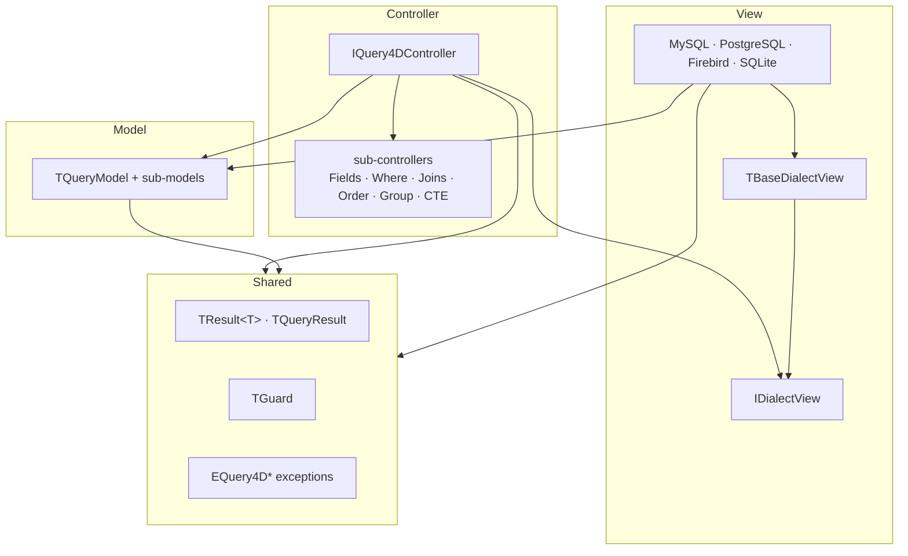
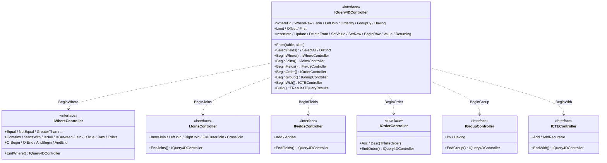
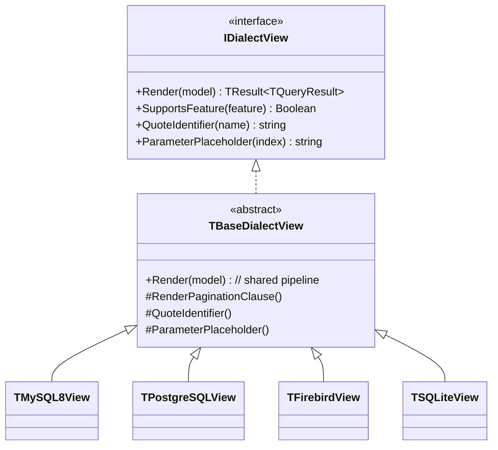

# Architecture

Query4D is a fluent SQL query builder for Delphi 10.3+ with **no framework dependencies**
(VCL/FMX/FireDAC are not required by the core). It is organized as a strict **MVC** with
Clean-Architecture dependency rules, so that adding a database dialect never touches existing code.

> **At a glance:** the Controller is the fluent API you chain; it mutates a passive Model
> (the query's state); on `Build`, a dialect-specific View renders that Model into `SQL` + `Params`.
> A `Shared` layer provides cross-cutting primitives (`TResult<T>`, `TGuard`, exceptions).

---

## The MVC roles

| Layer | Responsibility | Key types |
| ----- | -------------- | --------- |
| **Model** | Holds the query's state — never renders SQL | `TQueryModel` + sub-models (Field, Where, Join, Order, Group, CTE, Pagination, DML) |
| **View** | Renders a `TQueryModel` into SQL for one dialect | `IDialectView`, `TBaseDialectView`, `TMySQL8View`, `TPostgreSQLView`, `TFirebirdView`, `TSQLiteView` |
| **Controller** | The fluent API; mutates the Model, delegates to the View on `Build` | `IQuery4DController` + sub-controllers (Fields, Where, Joins, Order, Group, CTE) |
| **Shared** | Cross-cutting primitives | `TResult<T>`, `TQueryResult`, `TGuard`, `EQuery4D*` |

---

## Dependency rule



Allowed directions only: `Controller → Model`, `Controller → View (interface)`,
`View (impl) → Model`, and everyone → `Shared`. The Controller never depends on a concrete
dialect — it holds an `IDialectView` injected at construction.

---

## Folder layout

```
src/
├─ Shared/       TResult<T>, TQueryResult, TGuard, exceptions, escaper
├─ Model/        TQueryModel + Field / Where / Join / Order / Group / CTE / Pagination / DML
├─ View/         IDialectView + TBaseDialectView + 4 dialect views
└─ Controller/   TQuery4DController + sub-controllers (one per fluent sub-builder)
tests/
└─ Unit/         database-free tests, Given_When_Then naming
```

---

## The Controller composition

`IQuery4DController` is the entry point. Its sub-builders (`BeginWhere`, `BeginJoins`,
`BeginFields`, `BeginOrder`, `BeginGroup`, `BeginWith`) return focused interfaces that all
funnel back via `End…` into the same controller — so the chain reads top-to-bottom while each
concern keeps a small, single-purpose surface.



Each sub-controller writes into the shared `TQueryModel`; `End…` simply returns the parent
controller so chaining continues.

---

## The View / dialect model

A View turns the Model into SQL. `TBaseDialectView` implements the full render pipeline once;
each concrete dialect overrides only the points where SQL grammar differs.



Differences captured by overrides include identifier quoting (`` `col` `` vs `"col"`),
placeholder style (`?` vs `$1`), pagination grammar (`LIMIT/OFFSET` vs Firebird `FIRST/SKIP`),
and feature gating via `SupportsFeature` (e.g. `RETURNING`, RIGHT/FULL JOIN, native `NULLS` order).

---

## Flow · Build

```mermaid
sequenceDiagram
    participant App
    participant Ctrl as IQuery4DController
    participant Model as TQueryModel
    participant View as IDialectView (dialect)
    participant Res as TResult&lt;TQueryResult&gt;

    App->>Ctrl: From(...).Select(...).BeginWhere...EndWhere...
    loop each fluent call
        Ctrl->>Ctrl: TGuard validates arguments
        Ctrl->>Model: append field / predicate / join / ...
    end
    App->>Ctrl: Build
    Ctrl->>Ctrl: guard DML safety (UPDATE/DELETE need WHERE → EUnsafeOperation)
    Ctrl->>View: Render(Model)
    View->>Model: read state
    View->>View: quote identifiers, emit placeholders, paginate
    View-->>Ctrl: TResult&lt;TQueryResult&gt; (SQL + Params)
    Ctrl-->>App: Result
    App->>Res: IsOk? Value.SQL / Value.Params : Error.Message
```

Two distinct failure modes, by design:

- **Pre-render exceptions** (raised from the Controller, *before* `Render`): `EUnsafeOperation`,
  `EDialectNotInjected`, `EInvalidQuery`, `EInvalidAlias`. These are programmer errors and fail fast.
- **Render results** (returned as `TResult.Fail`, *no exception*): recoverable render problems are
  surfaced through `TResult<T>` so the call site decides via `IsOk` / `OnSuccess` / `OnFailure`.

---

## Safety guarantees

- Every WHERE/SET value becomes a **bind parameter** (`?` or `$N`) — never string-interpolated.
- `UPDATE`/`DELETE` without `WHERE` raise `EUnsafeOperation` in the Controller, before the dialect
  is even consulted — so the guard holds even when a test injects a mock View.
- `TGuard` validates preconditions at every public entry point (non-empty table/column, balanced
  logical groups, `Limit >= 1`, …).

---

## Extending: add a dialect (Open/Closed)

1. Create `Query4D.View.<Engine>` with a `T<Engine>View` class.
2. Inherit from `TBaseDialectView` and override only what differs — typically `QuoteIdentifier`,
   `ParameterPlaceholder`, `RenderPaginationClause`, and the relevant `SupportsFeature` cases.
3. (Optional) expose it on the `TQuery4D` component's `Dialect` enum.

No existing line changes — the Controller and Model are dialect-agnostic. See
[CONTRIBUTING.md](CONTRIBUTING.md) for the full step-by-step and the test checklist.
